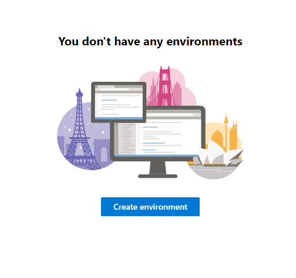
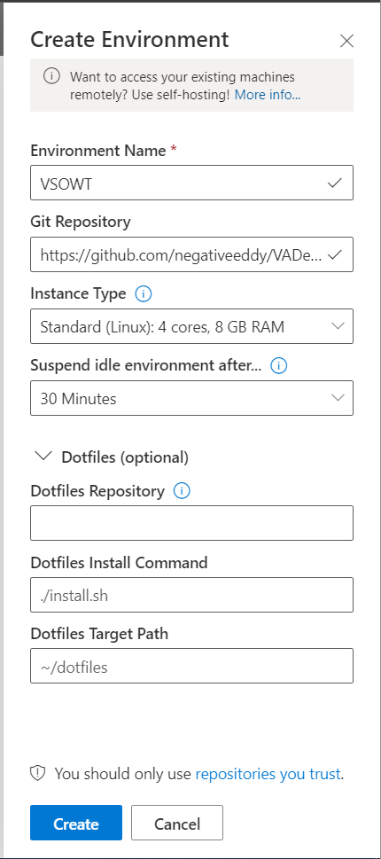
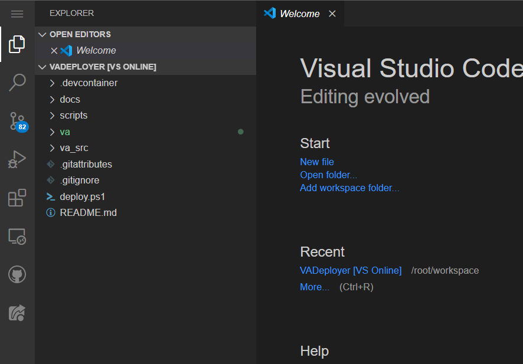

# Virtual Assistant Deployer Using Visual Studio Online 

This document will walk you through how to deploy a Virtual Assistant only using Visual Studio Online. 

## Things you need
1. An [Azure](https://azure.microsoft.com/) subscription 

## Deployment Instructions

1. Go to [Visual Studio Online](https://online.visualstudio.com/login) and log in using your azure credentials. 
2. If you don't already have a Visual Studio Online plan, click the drop down at the top of the screen and select "Create new plan". Fill out the "Create a Billing Plan" blade that appears at the right of the screen. 
3. Once you have a plan, click the "Create environment" button at the center of the screen. (Note: if you already have VSO environments, this button will be located at the top right of the screen.)




4. A "Create Environment" blade will appear at the right of the screen.
    * Pick a Environment Name
    * In the "Git Repository" field, copy the URL of the VADeployer repo (https://github.com/negativeeddy/VADeployer)
    * For "Instance Type" the "Standard (Linux): 4 cores, 8 GB RAM" Sku will work just fine. 
    * Choose the 30 Minutes idle time (The deployment process takes ~15 minutes) 
    * You don't need to change the "Dotfiles"
  
  
  
  5. Click "Create". (Note: It will take about 5 Minutes for everything to spin up.)
  
  6. You will need to wait until all the projects are loaded into your environment before continuing. The "va" project should be highlighted green. Your project should look like the picture below. 
  
   
  
  7. Click the hamburger menu at the top left of the screen. Navigate to "Terminal" --> "New Terminal"

  8. In the newly created terminal, log into Azure 
 ````
     az login
 ```` 
 9. A new window should open. Follow instructions to login
    * the instructions give you a link and a code. Browse to the specified link and enter the code
    
 10. [OPTIONAL] If you have multiple subscriptions, you can set which subscription to use by running
 ````
     az account set -s "<subscription name or id>"
 ````
 11. In the same terminal, run the deployment script and follow the prompts. 
  ````
 ./deploy.ps1
 ````
 
    * Name your bot
    * Choose the region
    * Create a password
    * Choose if you want to create a new LUIS Authoring Resource. If you choose "No" you will need to get your [Luis authoring key](https://www.luis.ai/user/settings) from your LUIS service. 
    * Choose your LUIS Authoring Region 
  (Note: It will take about 20 Minutes to deploy all of the Azure Resources)

 12. The terminal will say "Deployment complete." when everything is deployed. 
 
 ## How to talk to your assistant
1. Open the Azure portal and navigate to the Resource Group that has the name of your bot
2. Open the Web App Bot resource
3. Select the Test in Web Chat tab
4. Chat with your bot! 
NOTE: the first time you open the tab it may take a minute as the entire app needs to start up for the first time
## How to delete you assistant
1. Delete the Azure resource group
2. In the LUIS portal (https://luis.ai), delete the two LUIS apps named for your bot. There should be one marked General and one marked Dispatch.

# Additional Notes
The Virtual Assistant deployed is based on [Virtual Assistant Template v4.6.0.1](https://marketplace.visualstudio.com/items?itemName=BotBuilder.VirtualAssistantTemplate)

## Azure regions
This will deploy a virtual assistant to the WestUS Azure region by default and also assumes your LUIS authoring key is in the westus. If you wish to deploy to a different region and/or your LUIS key is not in westus, the deploy.ps1 script has additional parameters to override the defaults.

## Azure SKUs
By default the deployment will generate Azure SKUs that are typical of a real deployment (e.g. the App Service will be S1 Standard). If you wish to minimize the cost (e.g. just for quick demo purposes) you can specify the ````-minimalCost```` flag which will change many of the resources to the free/lower-cost versions.
**Warning** When using this flag you will see some side effects due to using the lower tier SKUs
* You may hit the rate & transaction limits of the various free service tiers when a team is actively developing a bot.
* You can not have more than one free search service in a subscription
* The free tier of app service plans will always shut down after a period inactivity. This will cause a significant delay in the first response after the inactivity.

## Contributing
This project welcomes contributions and suggestions from the community. 

This project has adopted the [Microsoft Open Source Code of Conduct](https://opensource.microsoft.com/codeofconduct/).
For more information see the [Code of Conduct FAQ](https://opensource.microsoft.com/codeofconduct/faq/) or
contact [opencode@microsoft.com](mailto:opencode@microsoft.com) with any additional questions or comments.

